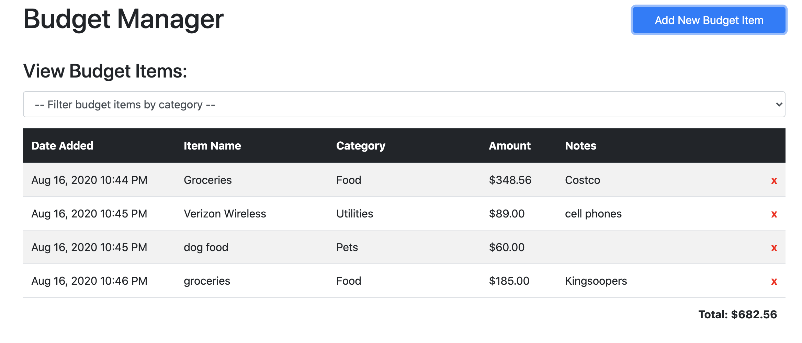

# Readme Generatro


## Description
Generates a good Readme.md file based on the input from the user.
  
## Link
Repo link: https://github.com/jttilley/readMeGenerator
  
## Author
Jason Tilley
  
## Tech Used
JavaScript, jQuery, Node.js, ES6, RegEx, python, APIs: weather, maps
  
## Table of Contents

* [Example](#example)

* [Installation](#installation)

* [Usage](#usage)

* [License](#license)

* [Contributing](#contributing)

* [Tests](#tests)

* [Questions](#questions)

  
## Example

  
## Installation
To install the necessary denpendencies, run the following command:
```
npm i
```

## Usage
run "node index.js" in the terminal
  
## License
The license for this project is: *MIT* ©  2020 Jason Tilley
  
  
## Contribution
Fork it
  
## Tests
* run it and answer the questions
* use semicolons to seperate a list
* include a colon to start a list if you would like
* add a local photo
  
## Questions
If you have any questions you can email me at: jttilley007@yahoo.com

  Also feel free to check out my GitHub page here: https://github.com/jttilley
  
  
