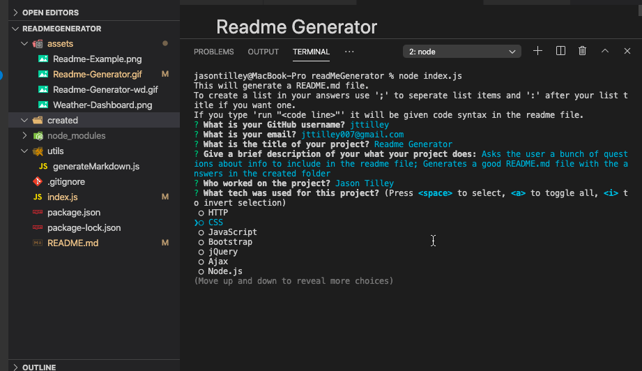

# Readme Generator


## Description
Generates a good Readme.md file based on the input from the user.
  
## Link
Repo link: https://github.com/jttilley/readMeGenerator
  
## Author
Jason Tilley
  
## Tech Used
JavaScript, jQuery, Node.js, ES6, RegEx
  
## Table of Contents

* [Example](#example)

* [Installation](#installation)

* [Usage](#usage)

* [License](#license)

* [Contributing](#contributing)

* [Tests](#tests)

* [Questions](#questions)

  
## Example
Example generating a basic readme for this project:



Example generating a readme with links and an example photo for a web based app using APIs:


## Installation
To install the necessary denpendencies, run the following command:
```
npm i
```

## Usage
run "node index.js" in the terminal
  
## License
The license for this project is: *MIT* ©  2020 Jason Tilley
  
  
## Contributing
Fork it
  
## Tests
* run it and answer the questions
* try using semicolons to create a bulleted list
* include a colon to start a list if you would like
* try adding a photo from a local folder
* try leaving the photo question blank
* try including 1 link, or both links, or no links
* try selecting APIs or Other in the Techs used list, and you will be asked extra questions
* try adding more than one author, or just a single author
  
## Questions
If you have any questions you can email me at: jttilley007@gmail.com

Also feel free to check out my GitHub page here: https://github.com/jttilley
  
  
